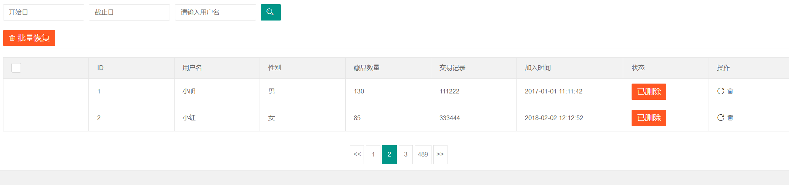
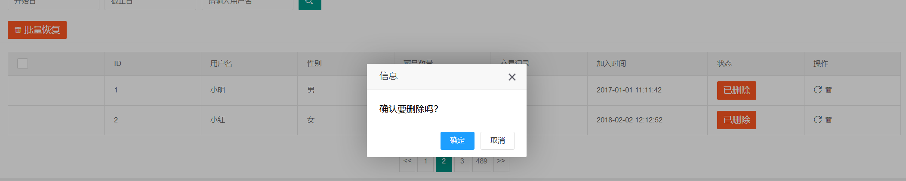
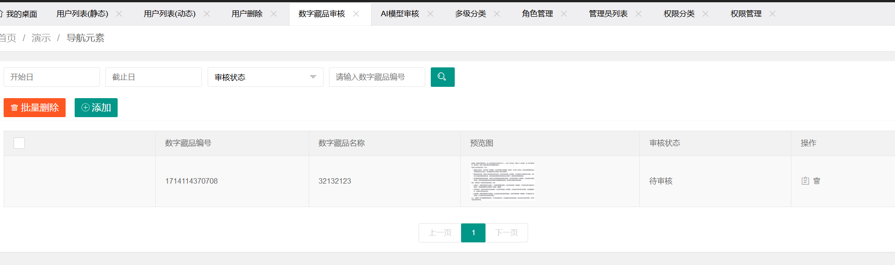
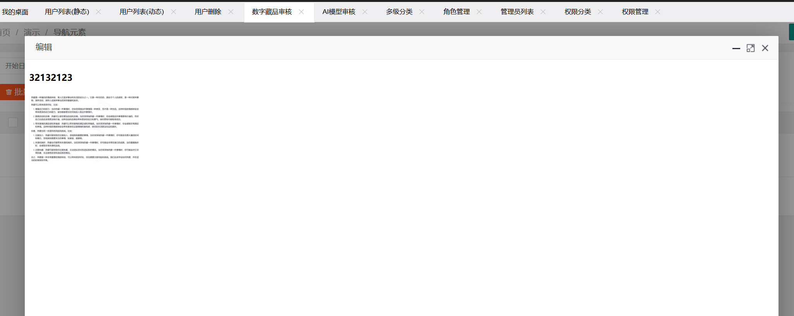
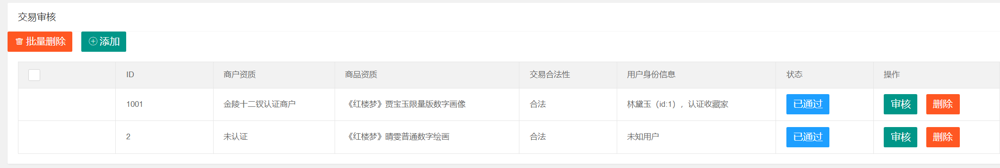
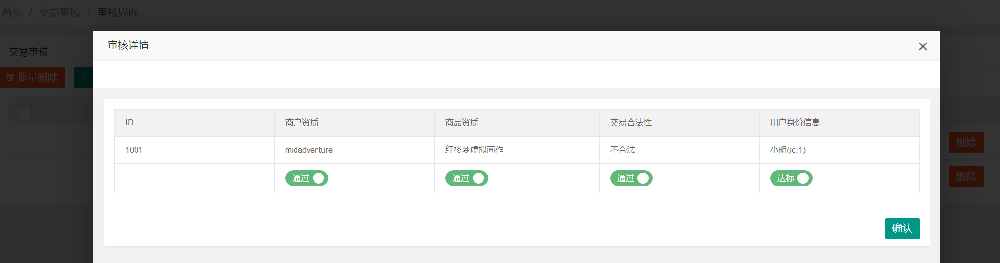

# Digital-collection-business-platform
## 1.用户数据获取
GET 前端无参请求 返回用户结构体数组 包含用户ID 用户名 性别 加入时间等用户个体信息

## 2.用户数据删除 
POST 前端入参用户ID 后端删除相应用户数据 返回删除状态

## 3.审核藏品数据获取 
GET 前端无参请求 返回审核藏品数据 包括藏品名称 审核状态 藏品图片 审核报告 等

## 4.藏品审核操作
POST 前端入参藏品ID 及审核动作（开始审核btn） 后端接受藏品相关信息 调用模型进行审核 返回审核报告 （可以非即时）

## 5.交易审核数据获取
GET 前端无参 获取交易记录结构体 结构体内包含每一条交易记录的相关信息

## 6.审核交易操作
POST 前端入参交易ID 和 审核动作（通过or不通过） 后端更新交易记录信息
